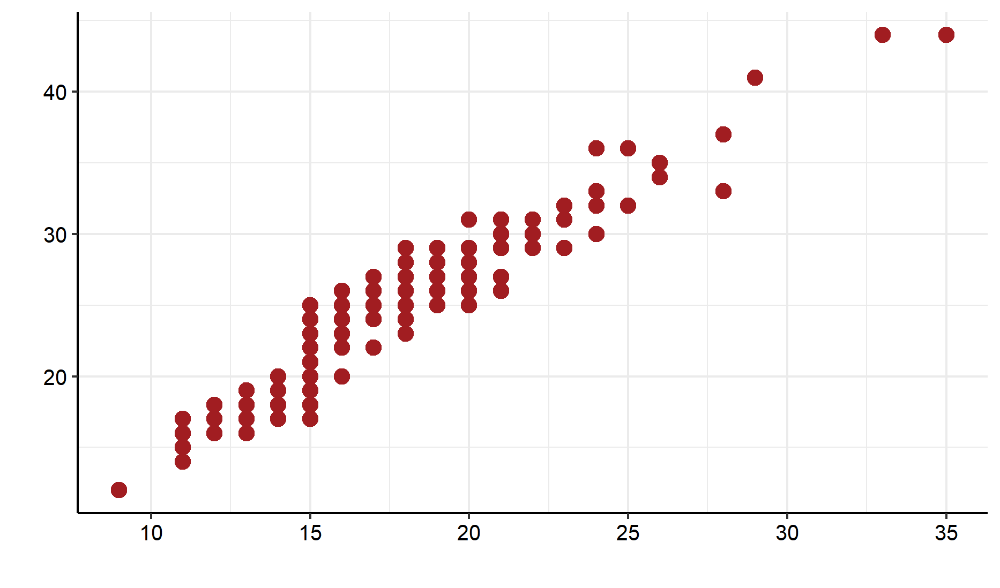

```{r}
#| include: false
source("rdocs/entrega_final.R")
```

# Introdução

  O seguinte projeto tem como objetivo realizar análises estatísticas para a a Old Town Road.Ltda, visando uma maior compreensão do mercado, dos clientes e do comércio na região, para ajudar a tomar decisões de investimento. Para isso, foram utilizadas análises descritivas para traçar perfis, rankings e análises de tendência temporal
para avaliar receita.

  O estudo utilizou um banco de dados fornecido pelo cliente, contendo mais de 20.000 observações, que prove informações das diversas empresas ligadas a holding. As pricipais variáveis incluiram dados de receita das lojas, características dos cliente, dados geográficos e informações operacionais.
  
  Para a execução das análises e tratamento dos dados, foi utilizado o software RStudio, plataforma que permite ao analista escrever o código, testar hipóteses e visualizar os dados de forma eficiente. A versão utilizada no desenvolvimento do projeto foi a 2025.09.1+401. Além disso, para gerar o arquivo também foi utilizado o Quarto que é um sistema de publicação técnica do projeto. Ele permite integrar o código da análise diretamente com o texto explicativo.

# Referencial Teórico

## Frequência Relativa

A frequência relativa é utilizada para a comparação entre classes de uma variável categórica com $c$ categorias, ou para comparar uma mesma categoria em diferentes estudos.

A frequência relativa da categoria $j$ é dada por:

$$
f_j=\frac{n_j}{n}
$$

Com:

-   $j = 1, \, ..., \, c$

-   $n_j =$ número de observações da categoria $j$

-   $n =$ número total de observações

Geralmente, a frequência relativa é utilizada em porcentagem, dada por:

$$100 \times f_j$$

## Média

A média é a soma das observações dividida pelo número total delas, dada pela fórmula:

$$\bar{X}=\frac{\sum\limits_{i=1}^{n}X_i}{n}$$

Com:

-   $i = 1, \, 2, \, ..., \, n$

-   $n =$ número total de observações

## Mediana

Sejam as $n$ observações de um conjunto de dados $X=X_{(1)},X_{(2)},\ldots, X_{(n)}$ de determinada variável ordenadas de forma crescente. A mediana do conjunto de dados $X$ é o valor que deixa metade das observações abaixo dela e metade dos dados acima.

Com isso, pode-se calcular a mediana da seguinte forma:

$$
med(X) =
    \begin{cases}
         X_{\frac{n+1}{2}}, \textrm{para n ímpar} \\
         \frac{X_{\frac{n}{2}}+X_{\frac{n}{2} + 1}}{2}, \textrm{para n par} \\
    \end{cases}
$$

## Quartis

Os quartis são separatrizes que dividem o conjunto de dados em quatro partes iguais. O primeiro quartil (ou inferior) delimita os 25% menores valores, o segundo representa a mediana, e o terceiro delimita os 25% maiores valores. Inicialmente deve-se calcular a posição do quartil:

-   Posição do primeiro quartil $P_1$: $$P_1=\frac{n+1}{4}$$

-   Posição da mediana (segundo quartil) $P_2$: $$P_2 = \frac{n+1}{2}$$

-   Posição do terceiro quartil $P_3$: $$P_3=\frac{3 \times (n+1)}{4}$$

Com $n$ sendo o tamanho da amostra. Dessa forma, $X_{\left( P_i \right)}$ é o valor do $i$-ésimo quartil, onde $X_{\left( j \right)}$ representa a $j$-ésima observação dos dados ordenados.

Se o cálculo da posição resultar em uma fração, deve-se fazer a média entre o valor que está na posição do inteiro anterior e do seguinte ao da posição.

## Variância

A variância é uma medida que avalia o quanto os dados estão dispersos em relação à média, em uma escala ao quadrado da escala dos dados.

### Variância Populacional

Para uma população, a variância é dada por:

$$\sigma^2=\frac{\sum\limits_{i=1}^{N}\left(X_i - \mu\right)^2}{N}$$

Com:

-   $X_i =$ $i$-ésima observação da população

-   $\mu =$ média populacional

-   $N =$ tamanho da população

### Variância Amostral

Para uma amostra, a variância é dada por:

$$S^2=\frac{\sum\limits_{i=1}^{n}\left(X_i - \bar{X}\right)^2}{n-1}$$

Com:

-   $X_i =$ i-ésima observação da amostra

-   $\bar{X} =$ média amostral

-   $n =$ tamanho da amostra

## Desvio Padrão

O desvio padrão é a raiz quadrada da variância. Ele avalia o quanto os dados estão dispersos em relação à média.

### Desvio Padrão Populacional

Para uma população, o desvio padrão é dado por:

$$\sigma=\sqrt{\frac{\sum\limits_{i=1}^{N}\left(X_i - \mu\right)^2}{N}}$$

Com:

-   $X_i =$ i-ésima observação da população

-   $\mu =$ média populacional

-   $N =$ tamanho da população

### Desvio Padrão Amostral

Para uma amostra, o desvio padrão é dado por:

$$S=\sqrt{\frac{\sum\limits_{i=1}^{n}\left(X_i - \bar{X}\right)^2}{n-1}}$$

Com:

-   $X_i =$ i-ésima observação da amostra

-   $\bar{X} =$ média amostral

-   $n =$ tamanho da amostra

## Boxplot

O boxplot é uma representação gráfica na qual se pode perceber de forma mais clara como os dados estão distribuídos. A figura abaixo ilustra um exemplo de boxplot.

{fig-align="center"}

A porção inferior do retângulo diz respeito ao primeiro quartil, enquanto a superior indica o terceiro quartil. Já o traço no interior do retângulo representa a mediana do conjunto de dados, ou seja, o valor em que o conjunto de dados é dividido em dois subconjuntos de mesmo tamanho. A média é representada pelo losango branco e os pontos são *outliers*. Os *outliers* são valores discrepantes da série de dados, ou seja, valores que não demonstram a realidade de um conjunto de dados.

## Gráfico de Dispersão

O gráfico de dispersão é uma representação gráfica utilizada para ilustrar o comportamento conjunto de duas variáveis quantitativas. A figura abaixo ilustra um exemplo de gráfico de dispersão, onde cada ponto representa uma observação do banco de dados.

{fig-align="center"}

## Tipos de Variáveis

### Qualitativas

As variáveis qualitativas são as variáveis não numéricas, que representam categorias ou características da população. Estas subdividem-se em:

-   **Nominais**: quando não existe uma ordem entre as categorias da variável (exemplos: sexo, cor dos olhos, fumante ou não, etc)
-   **Ordinais**: quando existe uma ordem entre as categorias da variável (exemplos: nível de escolaridade, mês, estágio de doença, etc)

### Quantitativas

As variáveis quantitativas são as variáveis numéricas, que representam características numéricas da população, ou seja, quantidades. Estas subdividem-se em:

-   **Discretas**: quando os possíveis valores são enumeráveis (exemplos: número de filhos, número de cigarros fumados, etc)
-   **Contínuas**: quando os possíveis valores são resultado de medições (exemplos: massa, altura, tempo, etc)

## Coeficiente de Correlação de Pearson

O coeficiente de correlação de Pearson é uma medida que verifica o grau de relação linear entre duas variáveis quantitativas. Este coeficiente varia entre os valores -1 e 1. O valor zero significa que não há relação linear entre as variáveis. Quando o valor do coeficiente $r$ é negativo, diz-se existir uma relação de grandeza inversamente proporcional entre as variáveis. Analogamente, quando $r$ é positivo, diz-se que as duas variáveis são diretamente proporcionais.

O coeficiente de correlação de Pearson é normalmente representado pela letra $r$ e a sua fórmula de cálculo é:

$$
r_{Pearson} = \frac{\displaystyle \sum_{i=1}^{n} \left [ \left(x_i-\bar{x}\right) \left(y_i-\bar{y}\right) \right]}{\sqrt{\displaystyle \sum_{i=1}^{n} x_i^2 - n\bar{x}^2}  \times \sqrt{\displaystyle \sum_{i=1}^{n} y_i^2 - n\bar{y}^2}}
$$

Onde:

-   $x_i =$ i-ésimo valor da variável $X$
-   $y_i =$ i-ésimo valor da variável $Y$
-   $\bar{x} =$ média dos valores da variável $X$
-   $\bar{y} =$ média dos valores da variável $Y$

Vale ressaltar que o coeficiente de Pearson é paramétrico e, portanto, sensível quanto à normalidade (simetria) dos dados.   

# Análises

## Análise temporal da Receita média

Esta análise tem como objetivo investigar a evolução temporal da receita média das lojas da Old Town Road.Ltda, a fim de identificar tendências de crescimento ou decrescimento ao longo do período observado. O estudo baseia-se em 19885 transações, coletadas de 18 lojas ao longo do período de 10 anos. Para essa ánalise utilizamos duas principais variáveis, a receita anual, variável quantitativa contínua, e o ano, variável quantitativa discreta que define o período do estudo. Para  ilustrar  as  análises,  será  utilizado um  gráfico  de  linhas.

```{r}
#| label: fig-linha
#| fig-cap: "Gráfico de linhas da receita média ao longo dos anos"


linha
```

Ao observar a $\ref{fig-linha}$ é notável a tendência geral de crescimento da receita média com o passar dos anos. Iniciando em 1880 com valores abaixo de R$ 105.399,00, apesar de uma breve estagnação entre 1881 e 1882, segue em trajetória de alta. Após uma pequena, queda em 1888, o ano de 1889 registra o maior crescimento de todo o período, levando a receita média ao seu pico de R$ 155.009,00. Indica não apenas uma tendência de crescimento, mas também uma forte capacidade de recuperação.

## Análise da Variação do Peso e da Altura dos clientes

Esta análise investiga a associação entre o peso (Kg) e a altura (cm) dos clientes. O objetivo é entender se existe uma relação entre estas duas variáveis quantitativas contínuas e qual a sua direção. Para  ilustrar  as  análises,  serão  utilizados um gráfico de dispersão, medidas resumo de cada variável e um teste de correlação para quantificar a força dessa associação.

```{r}
#| label: fig-dispersao
#| fig-cap: "Gráfico de Dispersão da altura pelo peso"


dispersao
```

::: {#quad-peso layout-align="center" quad-pos="H"}
```{=latex}
\begin{tabular} { | l |
			S[table-format = 3.2]
			|}
	\hline
		\textbf{Estatística} & \textbf{Valor} \\
		\hline
		Média & 75,19 \\
		Desvio Padrão & 11,92 \\
		Variância & 142 \\
		Mínimo & 45 \\
		1º Quartil & 66,9 \\
		Mediana & 75,3 \\
		3º Quartil & 83,2 \\
		Máximo & 119,3 \\
	\hline
	\end{tabular}
```

Medidas resumo da Variável Peso
:::

::: {#quad-altura layout-align="center" quad-pos="H"}
```{=latex}
\begin{tabular} { | l |
			S[table-format = 3.2]
			|}
	\hline
		\textbf{Estatística} & \textbf{Valor} \\
		\hline
		Média & 171,48 \\
		Desvio Padrão & 9,87 \\
		Variância & 97,38 \\
		Mínimo & 150 \\
		1º Quartil & 164,8 \\
		Mediana & 171,75 \\
		3º Quartil & 178 \\
		Máximo & 200 \\
	\hline
	\end{tabular}
```

Medidas resumo da Variável Altura
:::

  Ao analisarmos a $\ref{fig-dispersao}$ observamos uma clara têndencia positiva entre as duas variáveis. Os pontos no gráfico, mostram que à medida que a altura aumenta, o peso tende a aumentar. Para confirmar esta observação, o teste de correlação de Pearson resultou em r = 0,697 (p < 0,001), indicando uma correlação positiva de força moderada a forte.   
  
  Analisando o [**Quadro** @quad-peso] e [**Quadro** @quad-altura] que representam o peso e a altura dos clientes, observa-se que o peso médio dos clientes é de 75kg, variando de um mínimo de 45kg a um máximo de 119,30kg. As medidas de centralidade variam pouco, em torno de 70 a 80 Kg. Já a altura média é de 171,48cm, com clientes variando entre 150cm e 200cm, tendo valores de centralidade também próximos.

## Análise da variável idade pelas lojas de Âmbar Seco

Esta análise tem o objetivo de compreender a idade dos clientes em cada loja da cidade de Âmbar Seco, para que possam traçar o perfil dos clientes. O estudo se baseia em 415 observações. Para tal, foram utilizadas as variáveis idade que é quantitativa discreta, e as lojas que é qualitativa nominal. Para  ilustrar  as  análises,  serão  utilizados um gráfico boxplot e um quadro de medidas resumo.

```{r}
#| label: fig-bp
#| fig-cap: "Boxplot da idade dos clientes das lojas de Âmbar Seco"


bp
```


::: {#quad-idade layout-align="center" quad-pos="H"}
```{=latex}
\begin{tabular} { | l |
			S[table-format = 2.2]
			S[table-format = 2.2]
			S[table-format = 3.2]
			S[table-format = 2.2]
			|}
	\hline
		\textbf{Estatística} & \textbf{Banco Careca} & \textbf{Vendinha Rápida} & \textbf{Saloon} & \textbf{Ferraria Seca} \\
		\hline
		Média & 34,92 & 40,35 & 34,2 & 33,67 \\
		Desvio Padrão & 5,57 & 6,03 & 12,7 & 13,31 \\
		Variância & 31,06 & 36,39 & 161,23 & 177,18 \\
		Mínimo & 25 & 30 & 15 & 16 \\
		1º Quartil & 31 & 35 & 26 & 24 \\
		Mediana & 34 & 41 & 32,5 & 30,5 \\
		3º Quartil & 40 & 46 & 38 & 39 \\
		Máximo & 44 & 49 & 77 & 80 \\
	\hline
	\end{tabular}

```

Medidas resumo das idades dos clientes por loja
:::

  Analisando a $\ref{fig-bp}$ e o [**Quadro** @quad-idade],observa-se que a loja Vendinha Rápida se distancia das demais, possuindo o público consistentemente mais velho, média 40,35 e mediana 41. As outras três lojas possuem médias muito próximas, com Ferraria Seca, média 33,67, e Saloon de média 34,2 atendendo um público ligeiramente mais jovem que o Banco Careca de média 34,92. 

  Além disso, vale destacar a dispersão dos dados, as lojas Saloon e Ferraria Seca possuem os maiores desvios padrão, 12,70 e 13,31, respectivamente. Indicando uma diversidade de público muito maior, que é confirmada pela $\ref{fig-bp}$ com a presença de diversos outliers, representando clientes com idades muito acima da concentração. Em contraste, o Banco Careca é a loja com o público mais homogêneo e com a menor amplitude de idade, possuindo o menor valor máximo entre as quatro lojas.

## Análise dos 3 produtos mais vendidos nas lojas de maior receita em 1889

Esta análise tem o objetivo de identificar os produtos mais vendidos nas 3 lojas de maior receita em 1889, permitindo entender o perfil de vendas e a especialização de cada loja, para assim identificar o que impulsiona o sucesso em cada unidade. Para tal, utilizamos as variáveis lojas e produtos que são qualitativas nominais, e a quantidade que é quantitativa discreta. Para ilustrar, será utilizado um gráfico de colunas bivariado.

```{r}
#| label: fig-coluna
#| fig-cap: "Gráfico de colunas bivariado da quantidade de produto comprada por loja"


coluna
```
  Observando a $\ref{fig-coluna}$ conclui-se que os 3 produtos mais vendidos em cada loja é significativamente diferente entre as 3 lojas de maior receita, indicando uma forte especialização. A Loja TendTudo se destaca com a espingarda como seu carro-chefe. A Ferraria Apache e a Loja Ouro Fino apresentam um empate no volume de seus principais produtos, chapéu de couro e botas de couro, respectivamente. 

  Nota-se também a exclusividade de certos produtos: botas de couro (Ouro Fino), machado (Apache) e Colt .45 (TendTudo) aparecem no top 3 de apenas uma loja, reforçando a ideia de especialização. Por outro lado, produtos como whisky e espingarda demonstram uma popularidade mais ampla, figurando entre os mais vendidos em duas das três lojas.

# Conclusão

  Este projeto teve como principal objetivo fornecer uma compreenção aprofundada do mercado e dos clientes da Old Town Road.Ltda, visando maior melhor conhecimento do mercado. As análises feitas permitiram atender as expectativas do cliente, gerando insights estratégicos para melhores tomadas de decisão.   
  
  Em resposta ao objetivo de entender a evolução do mercado, foi identificada uma tendência de crescimento na receita média das lojas na década, indicando um mercado com potencial de expansão. A forte recuperação em 1889, após a única queda registrada em 10 anos, reforça a resistência do negócio.   
  
  Sobre o perfil dos clientes, as análises foram eficazes.Foi validada estatisticamente a forte associação positiva entre o peso e a altura dos clientes. O estudo do perfil de idade na cidade de Âmbar Seco revelou que as lojas atraem públicos diferentes com faixa etária distinta.   
  
  Já a análise do desempenho comercial identificou os pilares do sucesso nas lojas de maior receita. Revelando as especializações de cada loja, conclui-se que o perfil de vendas é único em cada unidade, com produtos-chave distintos impulsionando o desempenho.
  
  Portanto, o relatório estatístico entrega as informações solicitadas, detalhando a tendência do mercado, perfil dos consumidores e dinâmica de vendas.  